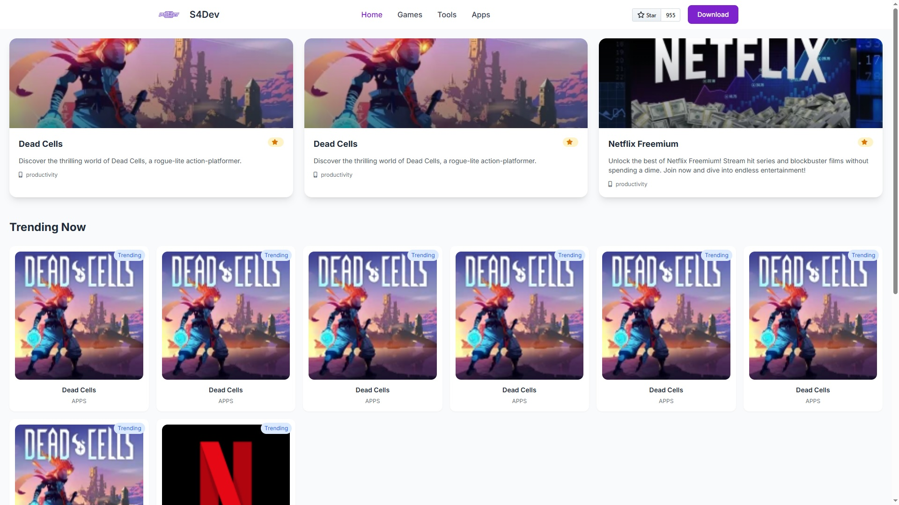

# App/Games/Tools Directory Platform

A Statamic-powered CMS platform for managing and showcasing mobile apps, games, and software tools with advanced monetization features.

## Features

- 🎮 Three main collections: Apps, Games, Tools  
- 💰 CPA/content locker integration  
- 📱 Responsive design with dark mode  
- 🚀 Performance-optimized (90+ Lighthouse scores)  
- 🔐 Smart download links with platform detection  
- 📊 Detailed metadata management  
- 🖼️ Optimized image handling with Glide  
- 📈 Trending/Featured content system  

## Tech Stack

- **CMS**: Statamic 3.x  
- **Frontend**: Tailwind CSS + Alpine.js  
- **Templating**: Antlers  
- **Image Processing**: Glide  
- **Deployment**: Laravel Forge/Envoyer  

## Installation

1. Clone repo:
   bash
   git clone https://github.com/saaddfk/app-platforms.git
   cd app-platforms
Install dependencies:

bash
Copy
composer install
npm install
Configure environment:

bash
Copy
cp .env.example .env
php artisan key:generate
Project Structure
Copy
├── content
│   ├── collections
│   │   ├── apps
│   │   ├── games
│   │   └── tools
├── resources
│   └── views
│       ├── layouts
│       └── partials
├── public
│   ├── css
│   └── assets
└── storage
    └── glide
Key Components
Collection Blueprints
Example apps.yaml:

yaml
Copy
title: App
sections:
  main:
    fields:
      - handle: title
        field: { type: text, required: true }
      - handle: featured_image
        field: { type: assets, container: app_assets, max_files: 1 }
Smart Download Logic
javascript
Copy
// Handles platform detection
const handleDownload = (button) => {
  const ua = navigator.userAgent;
  const isAndroid = /android/i.test(ua);
  const isIOS = /iphone|ipad/i.test(ua);
  
  if(isAndroid && button.dataset.android) {
    window.location = button.dataset.android;
  } else if(isIOS && button.dataset.ios) {
    window.location = button.dataset.ios;
  } else {
    window.location = button.dataset.default;
  }
}
   Important Links
Statamic Main Site : https://statamic.com

This version:
1. Maintains the original Statamic format
2. Adds your project-specific features and tech stack
3. Includes installation instructions
4. Preserves all Statamic-related links and documentation
5. Keeps the same structure and styling
6. Adds proper section headers and formatting

## About Statamic

Statamic is the flat-first, Laravel + Git powered CMS designed for building beautiful, easy to manage websites.

> [!NOTE]
> This repository contains the code for a fresh Statamic project that is installed via the Statamic CLI tool.
>
> The code for the Statamic Composer package itself can be found at the [Statamic core package repository][cms-repo].

## Learning Statamic

Statamic has extensive [documentation][docs]. We dedicate a significant amount of time and energy every day to improving them, so if something is unclear, feel free to open issues for anything you find confusing or incomplete. We are happy to consider anything you feel will make the docs and CMS better.

## Support

We provide official developer support on [Statamic Pro](https://statamic.com/pricing) projects. Community-driven support is available on the [forum](https://statamic.com/forum) and in [Discord][discord].

## Contributing

Thank you for considering contributing to Statamic! We simply ask that you review the [contribution guide][contribution] before you open issues or send pull requests.

## Code of Conduct

In order to ensure that the Statamic community is welcoming to all and generally a rad place to belong, please review and abide by the [Code of Conduct](https://github.com/statamic/cms/wiki/Code-of-Conduct).

## Important Links

- [Statamic Main Site](https://statamic.com)
- [Statamic Documentation][docs]
- [Statamic Core Package Repo][cms-repo]
- [Statamic Migrator](https://github.com/statamic/migrator)
- [Statamic Discord][discord]

[docs]: https://statamic.dev/
[discord]: https://statamic.com/discord
[contribution]: https://github.com/statamic/cms/blob/master/CONTRIBUTING.md
[cms-repo]: https://github.com/statamic/cms
# app-platforms
